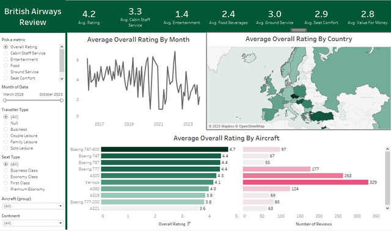

# ✈️ British Airways Review Dashboard

This project visualizes customer reviews for British Airways flights using **Tableau**, focusing on key aspects such as overall ratings, aircraft types, destinations, and service categories. The dashboard is designed to provide actionable insights to enhance customer experience and support data-driven decisions in the aviation industry.

## 🛠 Tools & Technologies

- **Tableau**: For building interactive visualizations and reports
- **Excel / CSV**: Source data format

## 📈 Key Insights

- Boeing 747 aircraft received the highest average rating (~4.7), while A321 had lower ratings.
- Cabin Staff and Entertainment scored the lowest across categories, suggesting areas for service improvement.
- Ratings fluctuated during the COVID-19 pandemic period (2020–2021).
- Europe had the highest volume of reviews with varying satisfaction levels by country.

## 🔍 Dataset Information

- **Source**: [Kaggle / Airline Quality Dataset](https://www.kaggle.com/)
- **Period**: March 2016 – October 2023
- **Columns**: Date, Traveller Type, Seat Type, Country, Rating Categories, Aircraft, etc.

## 📌 Objectives

- Practice building real-world dashboards using Tableau.
- Analyze customer satisfaction data in the airline industry.
- Develop skills in data storytelling and interactive filtering.

## 🚀 Future Improvements

- Add predictive modeling for rating trends.
- Embed natural language summaries of insights.
- Automate data refresh via API (if available).

---

Feel free to fork, use, or contribute to this project!

📬 **Contact**: [legiatienvinh@gmail.com]  
🌐 **Portfolio**: https://www.datascienceportfol.io/legiatienvinh)

https://public.tableau.com/app/profile/tien.vinh.le.gia/viz/BritishAirwaysReiview/Dashboard1
